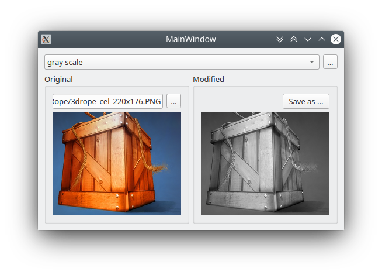
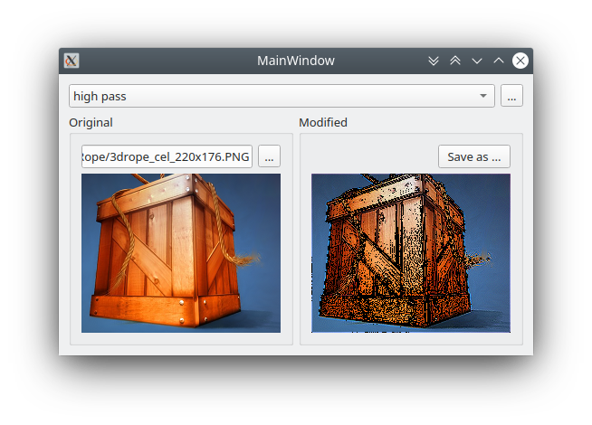

# image-filters
This QtWidgets/C++ desktop app apply some trivial* graphic transformations to raster images.
This program was made for my Computer Graphics classes.

## Grayscale

## High-pass (edge detector)

## Low-pass (blur)

