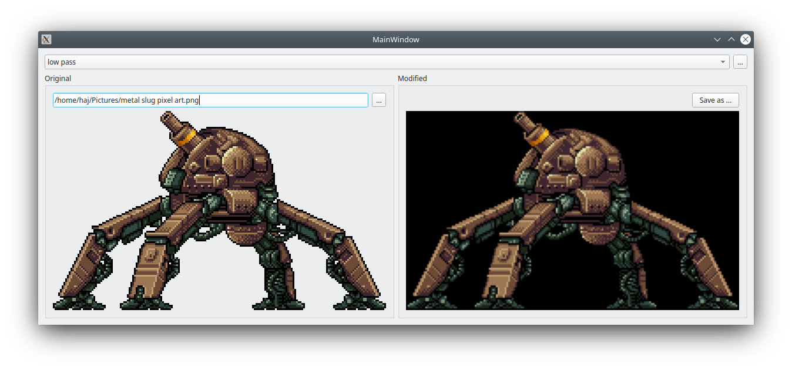

# image-filters



## What is it?
This Qt/C++ desktop app apply some trivial* graphic transformations to raster images.
This program was made for my Computer Graphics classes.

## What kind of filters?
- Low-pass
- High-pass
- Gray-scale
- Paletted

## How to build?
Have Qt5 installed, then:
```sh
qmake
make
```
🤙
